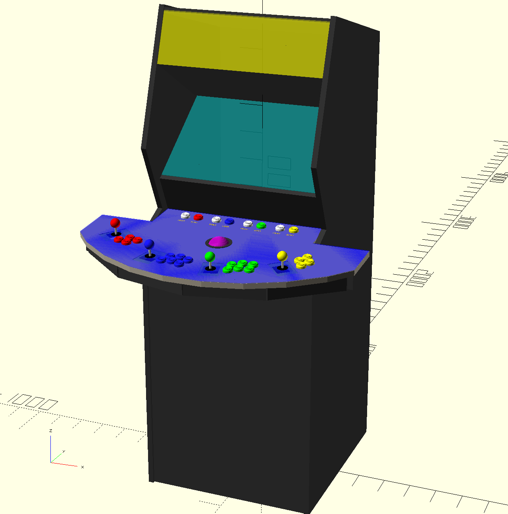

# OpenSCAD Arcade Modeling

This project contains models for designing and building arcade cabinets.

## Features

- Simple models for arcade controls: buttons, joysticks and trackballs
- Automatic generation of cutouts on control panel where controls are placed
- Support for multi layer control panel construction. ie. an MDF panel with an
  acrylic top sheet.
- Configurable for multiple players
- Countersunk joystick mounting for completely flat panels
- Output of .dxf files for use on a laser cutter.

## Build instructions

Installing OpenSCAD and opening the .scad files in this project should be all you
need to do to view the models.
You can get the latest release of OpenSCAD on the OpenSCAD website:
http://www.openscad.com

## Viewing the models

All of the model files can be viewed directly in OpenSCAD to see
examples of the models. The following libraries are included in this
repo:

- [controls.scad](controls.scad) - Models of common arcade controls.
  Currently implements a generic joystick, 28mm arcade buttons, and the
  Ultimarc U-Trak trackball. Also implements the concept of "control
  clusters" which is a set of controls clustered together in a specific
  orientation. ex. The joystick and buttons for a single player.
- [control_panel.scad](control_panel.scad) - Creates a control panel
  from one or more sheet materials (ie. MDF, perspex, etc) and places a
  configurable number of control clusters and start/coin buttons.
- [control_box.scad](control_box.scad) - Designs a custom enclosure box
  around a control panel generated by control_panel.scad.
- [cabinet.scad](cabinet.scad) - Simple model of a full size arcade
  cabinet using control_box and control_panel. Fun fact: model is based
  on a vintage "Track & Field" machine.

## Creating your own project

[example_2player_box.scad](example_2player_box.scad) shows how you can
use this library for your own custom arcade control box. To create your
own project, copy this file and add your new project to the Makefile.
When you type 'make', OpenSCAD will output a .dxf file with the layers
needed to lasercut your custom panel. (As-yet untested. You have been
warned!)

## Using the output

The intent of this project is to output design files that can be either directly
laser cut on materials (ex. acrylic),
or used to create cutting guides for materials that cannot be laser cut (ex. MDF
or plywood).
The project currently creates correct models for how panels should be cut,
but does not yet output appropriate design files. Stay tuned...

## TODO

The following features still need to be implemented

- PDF output of control panel layout to be used as template for graphics design
- Flattened layout of cabinet panels to use as cutting guide
- Support for side mounted pinball buttons
- Model "spinner" controls
- Model coin slots/door
- Model control boards and mounts
- Model speakers
- Add mounting holes for joysticks
- Allow vertical/horizontal/angle adjustment on control cluster placement instead
  of fixed by the formula.
- Allow 2 rows of control clusters
